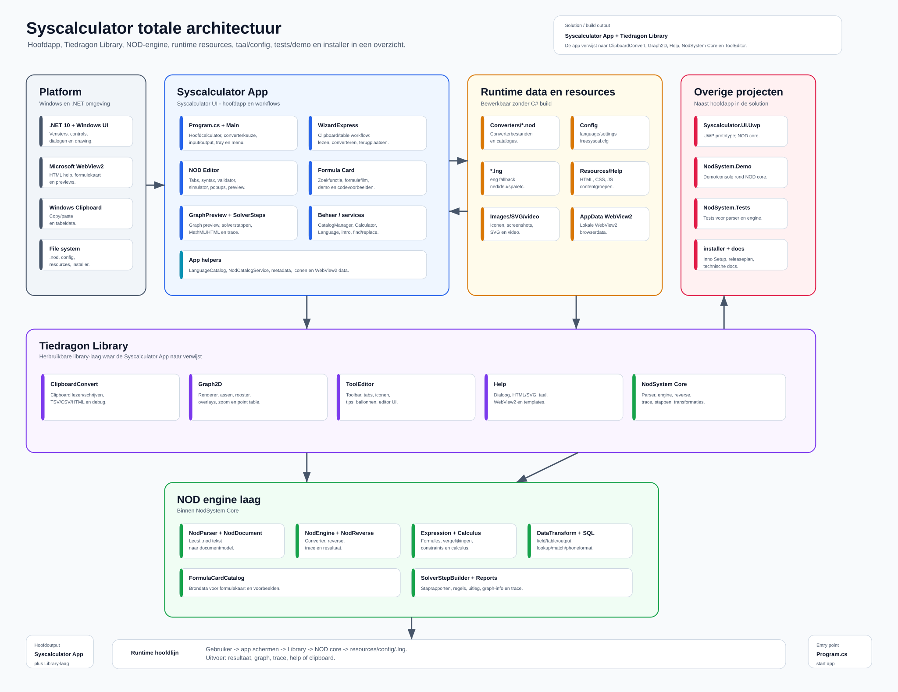
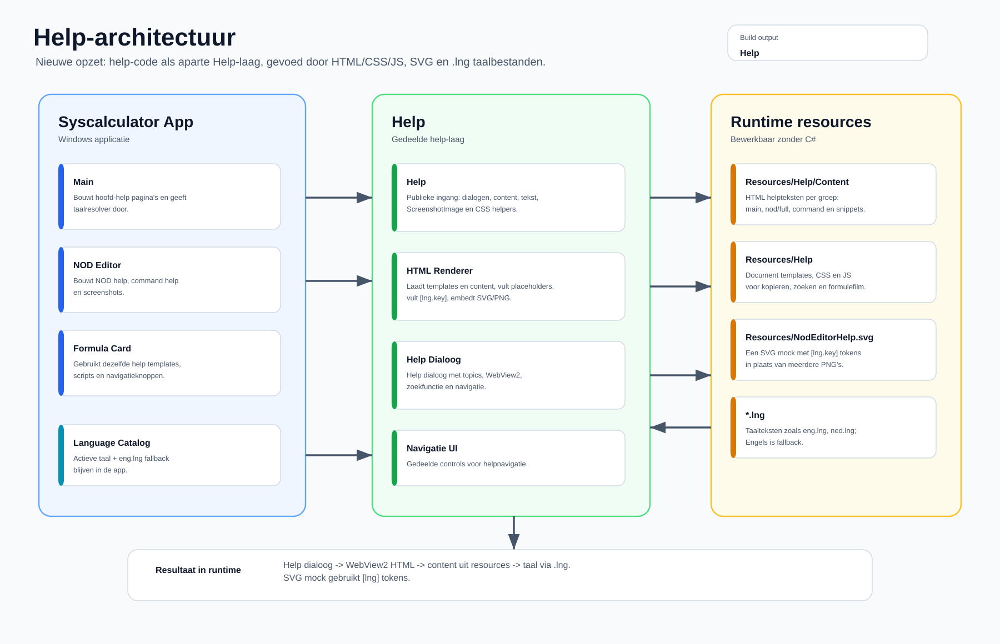
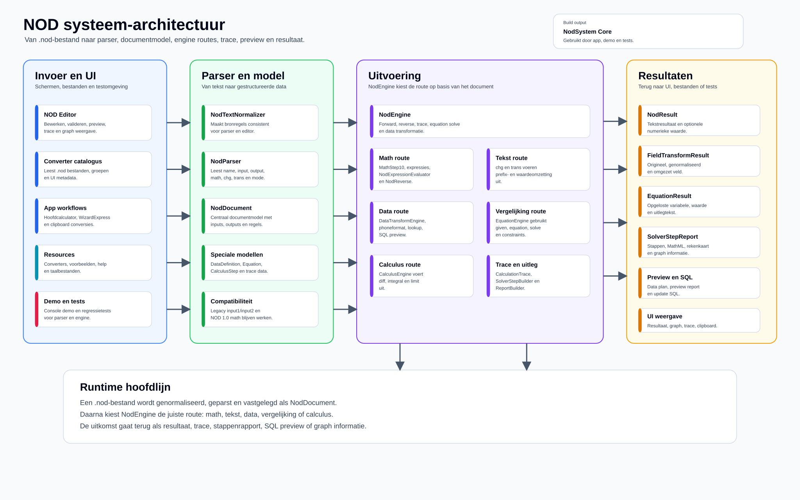
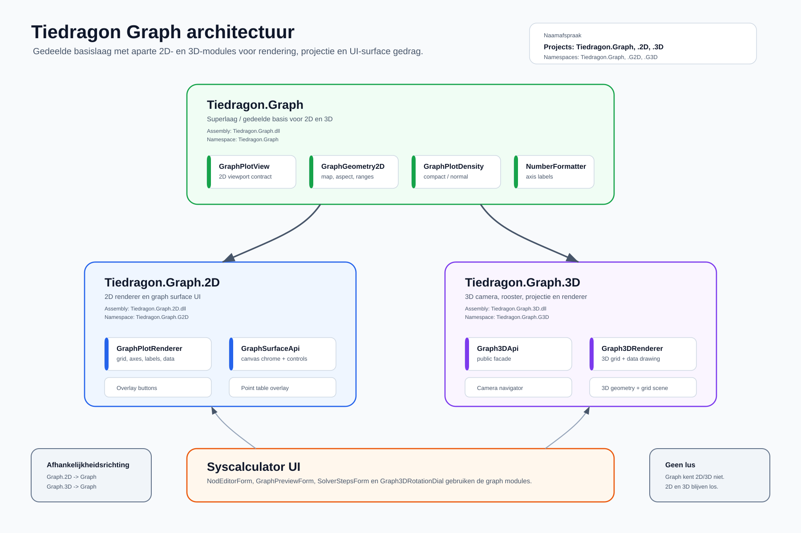

# Architectuurdocumenten

Dit is de ingang voor de actuele architectuurdocumentatie van Syscalculator.
De tekst staat in Markdown. De tekeningen staan als SVG zodat ze scherp blijven
op GitHub, in editors en in documentatie.

## Documenten

| Document | Doel |
|---|---|
| [Softwarearchitectuur](SOFTWARE_ARCHITECTURE.md) | Overzicht van de app, Tiedragon Library, NOD core, runtime resources en overige projecten. |
| [Help-architectuur](HELP_ARCHITECTURE.md) | Uitleg van de nieuwe help-laag, bewerkbare HTML/CSS/JS content, taalbestanden en SVG mockups. |
| [Language package design](LANGUAGE_PACKAGE_DESIGN.md) | Ontwerp voor ZIP-taalpakketten met `.lng`, help, manual en assets. |
| [`.lngpdk` pakketmodel](LNGPDK_PACKAGE_MODEL.md) | Praktisch model van wat er in een `.lngpdk` zit en hoe trust, manifest, help, formulekaarten en media samenhangen. |
| [Syscalculator geschiedenis](SYSCALCULATOR_HISTORY.md) | Historische lijn van Tiedos/Nodelistomzetter/Nodomzet naar Syscalculator 1.74 en 2.0. |
| [NOD systeem-architectuur](NOD_SYSTEM_ARCHITECTURE.md) | Uitleg van invoer, parser, documentmodel, engine routes en resultaten van het NOD systeem. |
| [Tiedragon Graph architectuur](TIEDRAGON_GRAPH_ARCHITECTURE.md) | Overzicht van `Tiedragon.Graph`, `Tiedragon.Graph.2D` en `Tiedragon.Graph.3D`. |

## Tekeningen

### Softwarearchitectuur

[SVG openen](SYSCALCULATOR_ARCHITECTURE.svg)

### Help-architectuur

[SVG openen](TIEDRAGON_HELP_ARCHITECTURE.svg)

### NOD systeem-architectuur

[SVG openen](NOD_SYSTEM_ARCHITECTURE.svg)

### [Tiedragon Graph architectuur](TIEDRAGON_GRAPH_ARCHITECTURE.md)

[SVG openen](TIEDRAGON_GRAPH_ARCHITECTURE.svg)

## Afspraak voor onderhoud

- Pas eerst de Markdown aan als de uitleg verandert.
- Pas daarna de SVG aan als blokken, pijlen of namen veranderen.
- Houd pijlen vast aan de randen van gekleurde blokken.
- Zet geen losse tekstlabels op pijlen als de richting al duidelijk is.
- Houd zichtbare namen kort: `Help`, `Graph2D`, `ToolEditor`, `NodSystem Core`.
